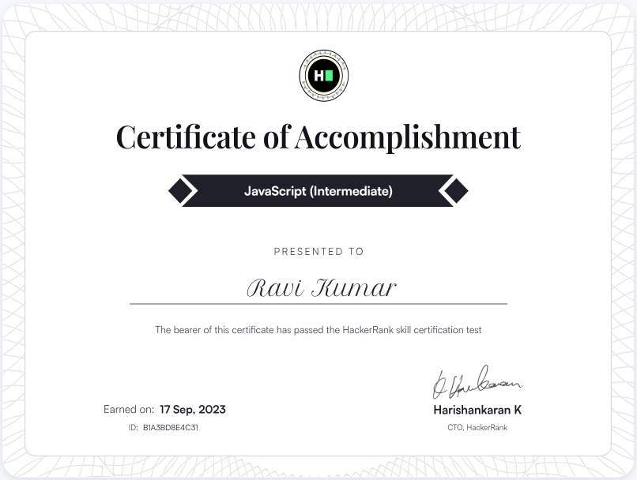
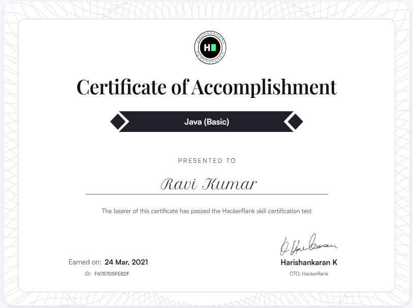

  

<h1 align="center">Hi, I'm Ravi Kumar 👋</h1>
<h3 align="center">Senior Software Engineer — Backend & SaaS Platforms</h3>

  
  

---

### About Me

- 🔭 Backend-focused engineer with 5+ years building and scaling SaaS platforms in **PHP (Laravel)** and, more recently, **Node.js/NestJS with Next.js**
- 🧑‍💻 Currently leading a two-person team as technical owner of an enterprise procurement platform, and driving core architecture for a new multi-tenant field service management product
- 🤖 Building **mfolio** — an AI-powered resume-to-portfolio tool (Next.js, Supabase, Google Gemini)
- 🛠️ Hands-on with event-driven systems, subscription/billing workflows, secure REST APIs, and multi-tenant architecture
- ⚡ I use AI coding agents (Claude Code, Antigravity) daily to move faster without cutting corners

---

### Tech Stack

**Languages:**   

**Frameworks:**    

**Databases:**   

**Other:** REST APIs · Multi-Tenant Architecture (schema-per-tenant) · Event-Driven Architecture · Stripe · Role-Based Access Control

---

### Featured Project

**[mfolio](https://github.com/ravikumarshah078/mfolio)** *(in development)*
Upload your resume (PDF/DOCX) → parsed and auto-populated into structured sections using Google Gemini → pick a theme → publish a shareable portfolio link via a custom slug.
`Next.js` · `Supabase` · `Google Gemini`

---

### Contribution Snake

  

---

### Reach Me

📧 ravikumarshah078@gmail.com · 💼 [LinkedIn](https://www.linkedin.com/in/ravi-kumar-shah/)

---

### Certifications

<table>
  <tr>
    <td align="center" width="50%">
      
       
      <b>JavaScript (Intermediate)</b> — HackerRank, Sep 2023
    </td>
    <td align="center" width="50%">
      
       
      <b>Java (Basic)</b> — HackerRank, Mar 2021
    </td>
  </tr>
</table>

Click any certificate to verify on HackerRank

